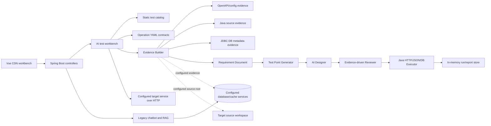
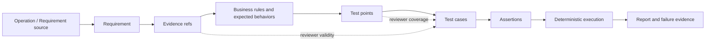

# Current Architecture

> Architecture baseline and implementation status. The Python platform is an
> independent project; no existing Java application or SUT source is modified
> by it.

## 1. Scope and evidence boundary

The analysis covered three local inputs:

| Role | Current input | Boundary |
|---|---|---|
| System Under Test (SUT) | User-provided API or the bundled example SUT | An external target observed through explicit evidence and execution adapters. |
| Existing implementation references | Historical Java/Spring prototype material | Design input only; the Python platform has no runtime dependency on it. |
| Private reference material | `Multi-Agent` PDFs | Architecture and prompt-engineering inspiration only; no private code, prompts, examples, or data are copied into the platform. |

The new platform must not import SUT classes, depend on its Maven project, compile
its controllers, use its business mappers, or assume its project name. It may be
configured with a generic source root, OpenAPI/Requirement source, test database,
base URL, authentication, and evidence policy.

## 2. Executive summary

The existing platform is a Spring Boot monolith with two unrelated bounded
contexts:

1. A legacy business application context with unrelated chatbot/RAG, persistence,
   and domain-specific services.
2. An AI API test workbench under the `aitest` package. This workbench already
   contains the most valuable migration material: typed domain objects, operation
   YAML contracts, evidence construction, requirement persistence, test-point
   generation, AI Designer/Reviewer flow, deterministic HTTP/JSON/DB execution,
   masking, and report structures.

The second context is a useful prototype, but it is not yet an independent
multi-project platform. Configuration is mostly singleton/global, the catalog and
operation contracts are domain-specific, generated requirements are file-based without
project ownership, runs are primarily in memory, and the implementation is tied to
Java source analysis and Java infrastructure. The frontend is Vue 3 from a CDN,
while the target requirement is React + TypeScript.

The migration should therefore be a clean Python platform built beside the Java
prototype, not a package-by-package translation inside the existing Spring Boot
application.

## 3. Current system topology



The intended platform boundary is the dashed relationship: the platform observes
and tests a target through explicit adapters. It must not become another module of
the target service.

## 4. Legacy Java reference architecture

### 4.1 Application and infrastructure

- Spring Boot 3.x, Java 17, Maven.
- LangChain4j OpenAI-compatible chat integrations, including DeepSeek-style
  configuration, chat memory, tools, and the legacy RAG pipeline.
- Redis vector store and optional embedding providers.
- MyBatis/MyBatis Plus/MySQL dependencies for legacy domain services and data.
- Spring Web/WebFlux, validation, Jackson, and an in-process HTTP client for test
  execution.
- Security utilities already exist for source path containment, sensitive path
  rejection, credential startup checks, security headers, and data masking.

The Maven dependency graph is broader than the API testing product needs. The
legacy chatbot/RAG stack and domain persistence layer should not be carried into
the Python core merely because they were present in the same Java application.

### 4.2 AI test workbench flow

The current test flow is:

1. Load a static catalog item and its operation YAML.
2. Build an `EvidenceBundle` from catalog facts, config, OpenAPI, operation YAML,
   Java source, and optional database metadata.
3. Build or merge a typed `RequirementDocument`, then save requirement/evidence
   YAML externally.
4. Generate deterministic and requirement-derived `TestPoint` objects.
5. Ask the AI Designer for structured test cases with evidence references.
6. Run a LangGraph workflow with NLU → Designer → semantic Reviewer. The
   Reviewer does not score or write complete cases; it emits bounded case
   specifications. Designer may perform one supplement pass, followed by a final
   Reviewer check.
7. Assemble immutable Final Cases. The result enters `READY` only when all test
   points are covered and no hard validation or Reviewer error remains; questions
   already accepted at Human Gate #1 stay visible as warnings. Otherwise it enters
   `NEEDS_CLARIFICATION`.
8. Wait at the Human Gate. The user confirms target environment, Base URL, case
   count, and side-effect cases before batch execution.
9. Execute cases through a deterministic Python HTTP/JSON/DB executor, then
   evaluate assertions and build a report.
10. Store execution results and reports in durable artifacts and expose them through the
   workbench API.

The older compatibility path is retained only for migration compatibility. The
Python target uses one explicit LangGraph workflow; it has one bounded supplement
pass, no unbounded repair loop, and no review score.

### 4.3 Domain model already present

The existing Java model is substantially richer than an untyped JSON prototype.
Important concepts are:

- Requirement: API, request parameters, response envelope/scenarios, business
  rules, expected behaviors, conflicts, unresolved questions, evidence refs.
- Evidence: source type, fact, reference, confidence, safe content, and bundle
  metadata.
- Test Point: explicit verification goal linked to requirement/evidence.
- Test Case: category, priority, preconditions, steps, expected behavior, source,
  evidence refs, and assertions.
- Assertion: HTTP status, JSON field/value/type/contains, headers, response time,
  response schema, and optional database checks.
- Review: coverage, invalid/missing evidence, duplicate/conflict findings, and
  reviewer-added cases.
- Execution/Report: request/response summaries, assertion outcomes, DB results,
  masked failure analysis, and aggregated status.

These models are reusable concepts, but their Java records/classes and Jackson
serialization are not the target implementation. The Python version must use
Pydantic v2 models as the primary contract.

### 4.4 Existing API surface

The current controller exposes approximately these product operations:

| Area | Current endpoint family | Observation |
|---|---|---|
| Catalog | `/api/ai-test/catalog`, `/catalog/{id}` | Static/global catalog, not project-scoped. |
| Requirement | `/requirements/build` | Uses a legacy request shape centered on `catalogId`; does not model a generic TestProject source. |
| Test points | `/test-points/generate` | Requirement-derived, partly deterministic. |
| Cases | `/cases/generate`, `/cases/validate` | AI Designer plus validation/review compatibility paths. |
| Execution | `/runs`, `/runs/{runId}` | Batch/direct execution with in-memory state. |
| Reports | `/reports`, `/runs/{runId}/analysis` | Reports can re-execute or analyze stored data, but persistence is limited. |

The API surface proves the intended workflow, but it is not yet a stable generic
platform contract. The Python API should introduce project/settings resources and
make every downstream object explicitly project- and operation-scoped.

### 4.5 Evidence implementation

Current evidence providers include:

- Catalog facts and configured target facts.
- Operation YAML facts.
- OpenAPI path facts.
- Java source facts parsed with the JDK compiler/AST APIs.
- JDBC `DatabaseMetaData` schema facts.

The Java source provider currently walks the configured Java source tree and
extracts Spring mappings, parameters, validation, delegated service text, and
success/failure signals. It is a useful proof of concept, but it is too broad for
the generic target architecture: source retrieval must be targeted by operation,
bounded by policy, and replaceable by scanners for Python, Go, Node, or .NET.

The DB provider is schema-oriented. Runtime data assertions are a separate
capability and already have useful protections: read-only access, table/column
identifier allowlists, timeout, row/field assertions, and masking. The distinction
between schema evidence and runtime test data must remain explicit in Python.

### 4.6 Persistence and configuration

Current persistence is split between:

- Classpath operation YAML and static catalog JSON.
- External generated requirement YAML and evidence YAML.
- Global application properties for target URL, source root, Java source path,
  OpenAPI path, DB metadata, request timeout, body limit, and storage location.
- In-memory run/report state.

This makes repeated local testing possible, but not multi-project operation. The
target platform needs a project settings store, operation/requirement ownership,
run history, provider status, and versioned artifacts. YAML remains a required
human-auditable artifact format; SQL persistence can be introduced for indexing,
history, and queryability without replacing the YAML source of truth.

## 5. Example SUT and adapter boundary

The repository includes a small standalone FastAPI example SUT so the complete
workflow can be exercised without any external application. A target may expose
any response envelope; the platform learns its contract from the requirement,
OpenAPI, source, and optional read-only database evidence. A common example is:

```json
{
  "success": true,
  "errorMsg": null,
  "data": {},
  "total": null
}
```

The bundled example focuses on two inventory operations:

| Operation role | Method/path shape | Main evidence |
|---|---|---|
| Item detail | `GET /items/{item_id}` | path parameter, success and not-found response |
| Item creation | `POST /items` | JSON request body and creation response |

The example configuration demonstrates important adapter requirements:

- Base URL, server address, database credentials, Redis, and RabbitMQ are
  environment/configuration concerns.
- Seed data, schema migrations, and test cleanup scripts are distinct artifacts;
  the platform should never execute arbitrary schema or cleanup scripts as part
  of normal evidence collection.
- Source code contains framework-specific details such as Spring mappings,
  MyBatis queries, Redis authentication, upload paths, and message queues. These
  must be exposed only through a generic evidence provider contract.

Authentication follows the same adapter boundary. Source scanning may suggest a
login operation, but execution uses a deterministic project Auth Provider:
`login` describes the request, `extract` describes where a token or cookie is
read, and `inject` describes how it is added to test requests. The provider is
HTTP and SMS providers are language-agnostic, so a target can be Java, Python,
Go, or have no source workspace. Authentication remains an optional,
language-agnostic project adapter rather than a platform-specific assumption.

## 6. Optional retrieval boundary

Some source applications may also contain unrelated chatbot or retrieval
subsystems with:

- LangChain4j chat memory and content retriever.
- Redis vector storage and embedding configuration.
- domain-specific tools, services, and persistence models.
- Policy routing and retrieval evaluation scripts.

This is not part of the API testing product. Its retrieval metrics and prompt
evaluation scripts are useful historical engineering evidence, but they are not a
valid acceptance baseline for the new platform. The Python migration should omit
this subsystem from the core and only add a generic RAG/retrieval adapter later if
a real requirement requires it.

## 7. Reference-material boundary

The private reference PDFs are not the platform architecture or orchestration
template. The Python product deliberately models a finite workflow with explicit
LangGraph state and stage contracts:

```text
NLU Agent → Designer Agent → Reviewer Agent
→ optional bounded Designer supplement → final Reviewer
→ Final Cases → Human Gate → Executor → Assertion → Report
```

The nodes have narrow responsibilities, the Reviewer emits findings rather than
complete cases, and the graph terminates before execution. Evidence chains,
confidence, structured JSON, parse guards, and call budgets are engineering
constraints of this product, not a free-form multi-agent conversation. No private
code, proprietary prompt file, private example, or private dataset is copied into
the platform or its repository.

## 8. Current strengths worth preserving

1. Evidence-first domain vocabulary and traceability fields.
2. Operation YAML as a human-readable, reviewable contract.
3. Explicit source/evidence types and safe references.
4. Typed requirement, test point, case, assertion, review, execution, and report
   boundaries.
5. Deterministic execution and assertion evaluation after AI design.
6. Reviewer checks for omissions, unsupported expectations, conflicts, duplicates,
   and missing evidence without producing a score.
7. Source path containment, sensitive-file rejection, credential masking, DB
   read-only controls, and response/body limits.
8. Timeout handling and frontend loading-state recovery already added in the Java
   prototype.

## 9. Current problems and migration impact

| Problem | Impact | Required response |
|---|---|---|
| Global `AiTestProperties` and static catalog | Multiple projects cannot be isolated | Introduce `TestProject` and project-scoped settings. |
| Domain-specific operation YAML, prompts, labels, and default names | Generic reuse is unsafe; new SUTs inherit wrong assumptions | Keep domain contracts in examples only and rewrite prompts generically. |
| Java compiler/AST source scanner | Works primarily for Java/Spring | Define `SourceEvidenceProvider`/scanner protocol; implement targeted Java first, then other languages. |
| LangChain4j annotations and SDK calls | LLM provider cannot be switched cleanly | Use a provider-neutral Python protocol and structured response adapter. |
| MyBatis/MySQL business layer in platform | Platform is coupled to SUT data model | Use SQLAlchemy-based, read-only, project-configured DB adapter. |
| Static/classpath and in-memory persistence | Restart loses runs; no audit/history/project ownership | Persist project settings, artifacts, runs, events, and report snapshots. |
| Legacy and evidence-driven generation paths coexist | Behavior and contracts are ambiguous | Select one V1 pipeline and preserve legacy behavior only in archived examples/tests. |
| Vue CDN frontend | Not React + TypeScript and settings are mostly presentation | Rebuild frontend around typed API clients and real project/settings forms. |
| Runtime assertions have edge-case gaps | False positives/negatives in execution | Define a versioned assertion contract and add structural/path/type tests before migration. |
| RAG is present by default in the old app | Adds latency and unrelated failure modes | Keep RAG optional; use direct sources first and targeted retrieval only when needed. |

## 10. Current-to-target traceability



This trace is the invariant to preserve during migration. Frameworks, SDKs,
frontend technology, and storage implementation may change; the links between
the artifacts must not disappear.

## 11. Current implementation status

The current Java implementation has enough domain and validation knowledge to
serve as a reference, but it is not a safe foundation for incremental language
translation in place. The target should be an independent Python/FastAPI
application with:

- project-scoped settings and generic operation contracts;
- Pydantic v2 schemas and explicit stage interfaces;
- direct Requirement/OpenAPI-first analysis;
- optional targeted source and DB evidence providers;
- provider-neutral LLM integration;
- deterministic `httpx` execution and assertion evaluation;
- YAML artifacts plus durable run/report history;
- React + TypeScript frontend;
- no import, Maven dependency, hard-coded path, or business coupling to the SUT.

The Python implementation contains the LangGraph design workflow through the
Final Cases/READY boundary, the mandatory Human Gate, deterministic batch HTTP
execution, JSON/header/schema assertions, durable run/report artifacts, and
unchanged-Requirement auto-regression. The remaining migration work is primarily
broader provider coverage, frontend production hardening, and black-box
acceptance against configured target projects.
