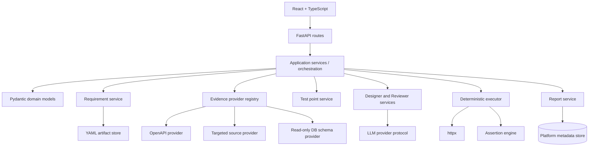

# Java to Python Migration Plan

> This is the proposed plan after Phase 0 analysis. It is intentionally staged:
> architecture confirmation is a gate before production code migration.

## Current checkpoint

The fixed LangGraph workflow and its execution boundary are implemented in the
Python project. The current sequence is:

```text
document parser -> evidence retriever -> NLU Requirement + Test Points
-> Designer -> semantic Reviewer
-> optional bounded Designer supplement -> final Reviewer -> Final Cases
-> Human Gate -> batch Executor -> Assertion Engine -> Report
```

The Reviewer has no score and the graph permits at most one evidence-grounded
supplement pass; it never enters an unbounded repair loop. Cases are executable
only after `READY` Final Cases receive an explicit target, Base URL, count, and
side-effect approval. Approved cases may be auto-regressed only while the
semantic Requirement fingerprint remains unchanged. Next work is focused on
provider/evidence breadth, frontend state recovery, and black-box acceptance.

## 1. Target outcome

Build an independent **Evidence-Driven AI API Test Platform** in Python. The
platform accepts a generic TestProject and one or more API Operation contracts,
constructs a traceable Requirement, gathers only the evidence needed to resolve
ambiguity, generates and reviews structured test cases, executes them
deterministically, and produces an auditable report.

```text
Requirement/OpenAPI
        ↓
LangGraph: NLU Agent (Requirement + Test Points)
        ↓
LangGraph: Designer Agent
        ↓
LangGraph: semantic Reviewer Agent
        ↓ optional, at most once
LangGraph: Designer supplement + final Reviewer
        ↓
Final Test Cases → READY
        ↓
Human Gate: target / Base URL / count / side effects
        ↓
Deterministic HTTP / JSON / DB Executor
        ↓
Assertion → PASS / FAIL → Report
```

The first real demonstration remains the existing Java SUT. After that, the same
platform must run against a small standalone FastAPI demo to prove that no Java or
domain-specific coupling remains.

## 2. Non-negotiable design principles

### 2.1 Platform/SUT separation

The platform may consume:

- a base URL and authentication configuration;
- OpenAPI/Swagger JSON or YAML, or a manually authored operation contract;
- a configured source workspace through a bounded evidence adapter;
- a read-only test database connection through a controlled DB adapter;
- runtime HTTP responses and explicit DB assertions.

The platform must not:

- import SUT classes or compile the SUT;
- depend on the SUT's build system or ORM;
- hard-code a SUT project name, local path, package, schema, controller, or
  business entity in the core;
- treat the SUT database as the platform database;
- send raw credentials or unbounded source/database content to an LLM.

### 2.2 Evidence before confidence

Every business rule and non-obvious expected behavior must carry an evidence
reference and confidence. The system may infer, but it must label inference. A
missing fact becomes an unresolved question rather than an invented business
rule.

### 2.3 Structured contracts at every stage

Pydantic models are the canonical contracts. A plain `dict[str, Any]` is allowed
only at external-provider boundaries and must be parsed immediately into a typed
model. Persisted YAML is validated on both load and save.

### 2.4 Deterministic execution after AI design

The LLM may propose cases, expected behavior, and assertions within supported
types. It does not perform the HTTP request, decide whether a response passed, or
invent a database result. Execution and pass/fail evaluation belong to
deterministic Python services.

### 2.5 Direct sources first; RAG only when needed

For one operation, Requirement and OpenAPI evidence are the default. Source code
and DB metadata are optional providers triggered by missing or conflicting facts.
RAG is a later optimization, not a V1 prerequisite.

## 3. V1 target architecture

### 3.1 Runtime layers



The application layer owns stage sequencing. Routes translate HTTP requests to
application commands and never compose prompts or execute raw SQL. Providers know
how to read a source; they do not decide business meaning. Designer and Reviewer
consume typed inputs; they do not read the target workspace directly.

### 3.2 Recommended repository shape

The new project directory should evolve toward:

```text
ai-api-test-platform-python/
├── backend/
│   ├── app/
│   │   ├── main.py
│   │   ├── api/
│   │   ├── core/                 # settings, logging, errors, security
│   │   ├── models/               # Pydantic domain and API models
│   │   ├── projects/             # TestProject and settings
│   │   ├── requirements/         # sources, builder, YAML store
│   │   ├── evidence/
│   │   │   ├── providers/        # requirement/openapi/source/db
│   │   │   └── scanners/          # targeted language/framework scanners
│   │   ├── testpoints/
│   │   ├── designer/
│   │   ├── reviewer/
│   │   ├── executor/
│   │   ├── assertions/
│   │   ├── reports/
│   │   ├── providers/             # LLM and future external providers
│   │   └── tests/
│   └── pyproject.toml
├── frontend/
│   ├── src/
│   │   ├── api/
│   │   ├── types/
│   │   ├── pages/
│   │   ├── components/
│   │   └── state/
│   └── package.json
├── examples/
│   ├── requirements/
│   └── sample-project/
├── docs/
├── .env.example
├── SECURITY.md
└── README.md
```

Domain-specific operation contracts and generated YAML should live under
`examples/` or a local, ignored fixture area. They must not become platform
defaults.

## 4. Core domain contracts

### 4.1 TestProject

Minimum fields:

```text
project_id, name, description, enabled
requirement_sources[]
openapi_sources[]
source_workspace (optional, policy checked)
database_profile (optional, read-only)
sut_target (base_url, timeout, redirect policy, auth reference)
llm_profile (provider, model, prompt version, budget)
created_at, updated_at
```

Secrets are references to environment/private configuration, never values in
frontend payloads or persisted YAML.

### 4.2 RequirementDocument

One API Operation is one Requirement. The stable shape is:

```text
requirement_id, version
api: operation_id, method, path, summary, parameters, request_body
response: envelope, success_statuses, schema, scenarios
preconditions[]
business_rules[]
expected_behaviors[]
conflicts[]
unresolved_questions[]
evidence_refs[]
source_snapshot, generated_at, change_summary
```

An operation is identified by its HTTP method + path template, with a stable
operation id supplied by the project contract. Query/body/header/path parameters
must retain location, type, requiredness, constraints, examples, and sensitivity.

### 4.3 Evidence

```text
EvidenceFact:
  evidence_id, source_type, reference, fact, confidence,
  operation_id, safe_excerpt, collected_at, metadata

EvidenceBundle:
  operation_id, facts[], provider_status[], conflicts[], snapshot_id
```

`reference` is safe and portable. Absolute local paths are normalized or omitted
from persisted artifacts. Raw source, DB credentials, authorization headers, and
large response bodies are never included in LLM prompts without sanitization and
size limits.

### 4.4 TestPoint, TestCase, Review, Execution, Report

- `TestPoint`: requirement id, evidence refs, category, action, expected result,
  priority, and explicit source (`requirement`, `evidence`, `reviewer`).
- `TestCase`: stable id, test point refs, category, priority, preconditions,
  request template, expected behavior, assertion list, evidence refs, and source.
- `ReviewResult`: omission findings, unsupported expectations, evidence conflicts,
  duplicates, unresolved questions, and reviewer-added case proposals. It does
  not contain a score or coverage score.
- `ExecutionResult`: request summary, response summary, assertion results, DB
  assertion results, timing, status, error category, and evidence refs.
- `TestReport`: run metadata, case summaries, aggregate counts, traceability gaps,
  failures, and masked diagnostic details.

## 5. Evidence provider strategy

Define a small protocol rather than a framework-dependent inheritance tree:

```python
class EvidenceProvider(Protocol):
    provider_type: str

    async def health(self, context: EvidenceContext) -> ProviderStatus: ...

    async def retrieve(
        self,
        context: EvidenceContext,
        query: EvidenceQuery,
    ) -> EvidenceBundle: ...
```

V1 providers:

1. `RequirementSourceProvider`: Markdown, YAML, JSON, OpenAPI JSON/YAML, and
   Swagger URL ingestion.
2. `OpenApiEvidenceProvider`: operation summary, parameters, request/response
   schema, status codes, examples, security schemes.
3. `SourceEvidenceProvider`: targeted operation lookup. First adapter may support
   Java/Spring annotations because the demo SUT is Java, but the interface must be
   language-neutral.
4. `DatabaseSchemaEvidenceProvider`: SQLAlchemy metadata inspection, read-only
   and allowlisted, clearly distinct from runtime data.

Optional providers can report `not_configured` without turning the whole pipeline
into an error. A real provider error is visible and traceable; it is not silently
converted into an LLM guess.

## 6. LLM provider and prompt design

### 6.1 Provider abstraction

Use a provider protocol such as:

```text
chat(messages, response_model, model_settings) -> ParsedModel
```

Adapters may support OpenAI-compatible endpoints, the official OpenAI client, or
another provider. Application code must depend on the protocol, not a vendor SDK.
The adapter owns timeout, retry, JSON/schema parsing, call budget, request/response
logging policy, and provider-specific error mapping.

### 6.2 Prompt boundaries

- NLU: emits Requirement and Test Points atomically for one Operation, preserving
  evidence references and unresolved questions for Human Gate #1.
- Designer: receives Final Requirement, Test Points, and sanitized evidence; does
  not receive an unrestricted workspace path.
- Reviewer: receives Requirement, Test Points, cases, and evidence; emits bounded
  case specifications rather than complete cases and may not invent unsupported
  business facts.
- Failure analyzer/report summarizer: receives masked execution evidence and
  structured assertion results.

Prompt assets are versioned and generic. Each run records prompt version, model
identifier, provider, token/call budget, and parse/retry outcomes. Private
Multi-Agent prompt text is not copied into the repository.

### 6.3 LangGraph orchestration choice

Use LangGraph for the explicit linear workflow and checkpointed stage state:

```text
document_parser → evidence_retriever → nlu_agent
→ designer_agent → reviewer_agent
→ [optional supplement_designer_agent → final_reviewer_agent]
→ final_case_assembler → END
```

This is a workflow, not a free-form multi-agent conversation. The graph has no
unbounded repair loop, no score-based branch, and no automatic execution edge.
It permits one bounded Designer supplement pass only when Reviewer emits concrete
specifications, then performs a final review. The graph terminates at `READY` or
`NEEDS_CLARIFICATION`. The Human Gate and deterministic execution are separate
post-graph stages.

## 7. Requirement and operation source model

The product should support a new-project flow:

1. Create TestProject.
2. Configure one or more Requirement/OpenAPI sources.
3. Discover or import API Operations.
4. Select one operation.
5. Build and review its Requirement.
6. Generate Test Points, cases, review, and execution.

The platform should not make source code or database configuration mandatory for
Requirement creation. If OpenAPI is absent, a manually authored operation YAML is
the minimum contract. Source and DB evidence are targeted enrichment paths.

## 8. Deterministic executor plan

### 8.1 HTTP

Use `httpx.AsyncClient` with:

- per-project base URL and timeout;
- no redirects unless explicitly configured;
- allowlist/remote-target policy;
- masked request/response logging;
- response body size limit;
- cancellation and per-case timeout;
- explicit authentication reference resolution.

### 8.2 Assertions

V1 supported assertions:

- HTTP status in/equals;
- JSON path value, type, existence, contains, and collection length;
- response header value/presence;
- response schema subset;
- response time threshold;
- optional read-only DB row count/field value.

JSON path syntax must be documented and tested. Failure messages should preserve
the expected/actual values after masking. Compound expressions such as `<=500`
must be parsed consistently rather than treated as a raw integer.

### 8.3 Execution persistence

Store immutable run and case results, not just the current in-memory state. A
report must be reproducible from the stored request template, resolved non-secret
inputs, response summary, assertion results, and artifact versions.

## 9. Frontend migration plan

Replace the current Vue CDN workbench with React + TypeScript and a typed API
client. The initial page model can preserve the proven flow while changing the
contracts:

1. Dashboard and project list.
2. TestProject create/edit/settings.
3. Operation catalog and source health.
4. Requirement/evidence review.
5. Test points.
6. Cases and assertions.
7. Final Cases review and Human Gate.
8. Execution/run history.
9. Reports and traceability.

The frontend should show provider status as `not_configured`, `healthy`, or
`error`, never expose API keys, DB passwords, or raw credentials. Long-running
actions need cancellation, timeout, progress, terminal state, and error recovery.
The current Vue normalization logic for snake_case/camelCase is a migration
warning: the Python API should publish one stable naming convention and the
TypeScript types should be generated or maintained against it.

## 10. Phased implementation plan

### Phase 0 — Architecture and migration baseline

Status: completed by this document set.

Deliverables:

- current architecture and boundary analysis;
- migration plan and target structure;
- no Java/SUT mutation;
- explicit confirmation gate.

### Phase 1 — Python skeleton and project/settings

Implement:

- FastAPI application, health endpoint, typed settings, error model;
- `TestProject` CRUD or local file-backed project store;
- project-scoped target/auth/source/DB/LLM settings;
- secret references and `.env.example`;
- generic README/SECURITY documentation;
- no domain-specific name/path in defaults.

Acceptance:

- startup without LLM, DB, or source workspace;
- create/select a project through API;
- settings response is fully sanitized;
- unit tests prove no secret values are returned.

### Phase 2 — Domain models, YAML artifacts, and source ingestion

Implement Pydantic models, versioned YAML stores, source registry, OpenAPI
loading, operation discovery, validation, and snapshot metadata.

Acceptance:

- load a generic OpenAPI fixture and discover operations;
- load a manually authored operation YAML;
- round-trip Requirement/Evidence/TestPoint models;
- reject malformed/unsupported contracts with actionable errors.

### Phase 3 — Requirement builder and evidence providers

Implement direct Requirement/OpenAPI-first build, provider health, targeted
evidence query, conflict/question handling, and the first generic Java/Spring
scanner adapter for the demo SUT.

Acceptance:

- build a Requirement without source code or DB configured;
- enrich only an ambiguous operation with source/DB evidence;
- return optional provider `not_configured` status cleanly;
- sanitize source excerpts and DB metadata before any LLM call;
- persist `evidence_refs` and `unresolved_questions`.

### Phase 4 — Test Point Generator

Implement deterministic points from requirements and evidence, including required
parameters, boundary/error behavior, response envelope, and unresolved-question
handling.

Acceptance:

- every generated point maps to a requirement/evidence ref;
- duplicates are stable and removed;
- missing path/query/body parameters create explicit points or validation errors;
- point generation is testable without an LLM.

### Phase 5 — AI Designer and Reviewer

Implement LangChain structured NLU/Designer/Reviewer agents, LangGraph
sequencing, case validation, semantic review findings, one bounded Designer
supplement pass, and Final Cases assembly.

Acceptance:

- fake provider tests cover valid JSON, malformed JSON, timeout, retry, and schema
  failure;
- Designer cannot emit unsupported assertions without validation failure;
- Reviewer identifies missing points, unsupported expectations, conflicts, and
  duplicates without scoring;
- Final Cases are `READY` only after deterministic coverage and unresolved-gap
  checks; otherwise the workflow is `NEEDS_CLARIFICATION`.

### Phase 6 — Deterministic execution and DB assertions

Implement `httpx` executor, request rendering, auth resolution, assertion engine,
optional SQLAlchemy read-only DB assertions, and immutable execution results.

Acceptance:

- run against a mock HTTP service first;
- verify HTTP 200 with `success=false` is reported as a business failure when the
  contract requires success;
- verify JSON path/type/headers/schema/response-time assertions;
- verify DB identifier allowlists and read-only behavior;
- verify timeout, cancellation, redirect, body limits, and masked logs.

### Phase 7 — Reports, history, and frontend

Implement report snapshots, traceability views, run history, React pages, typed
API client, progress/error states, and project/settings UI.

Acceptance:

- a user can create a project, import an operation, build a Requirement, generate
  cases, run selected cases, and inspect a report without direct file editing;
- refresh/restart does not erase completed run history;
- frontend never displays secret values.

### Phase 8 — External SUT integration demonstration

Configure a target service as an external project using an environment-provided
base URL, OpenAPI/operation contracts, optional source root, and optional
read-only DB. Use only generic adapters; do not copy target service classes into
the platform.

Acceptance:

- all selected read operations can be discovered/imported;
- Requirement evidence distinguishes contract, source, schema, and runtime data;
- deterministic runs cover success and business-failure envelopes;
- no platform source/config/default contains a domain-specific hard-coded path or
  credential.

### Phase 9 — independent FastAPI demo

Create a small standalone FastAPI SUT with a different domain and schema. Run the
same platform flow against it.

Acceptance:

- no Java scanner is required for Requirement/OpenAPI-first flow;
- operation, Requirement, test points, assertions, and report are generic;
- platform tests pass with the Java SUT configuration removed.

## 11. Java-to-Python mapping

| Current Java concept | Python target | Migration decision |
|---|---|---|
| Spring Boot controllers | FastAPI routers | New API contracts; do not mirror legacy request quirks. |
| Java records/classes in `aitest` | Pydantic v2 models | Preserve concepts and traceability, redesign names/serialization once. |
| `AiTestProperties` | Pydantic Settings + project settings | Remove singleton domain defaults; separate app and project configuration. |
| Operation YAML | YAML artifact store + OpenAPI importer | Preserve human-auditable YAML, move domain-specific files to examples. |
| `EvidenceBuilderService` | Evidence orchestrator + provider registry | Preserve provider composition, add targeted query and health status. |
| JDK Java AST scanner | `SourceEvidenceProvider` + language scanner | Java first for demo, protocol remains language-neutral. |
| JDBC metadata provider | SQLAlchemy schema provider | Read-only, allowlisted, project-scoped. |
| LangChain4j AI services | LLM provider protocol | No business code depends on SDK annotations. |
| Java `HttpClient` runner | `httpx` async executor | Preserve deterministic behavior and limits. |
| Assertion services | Python assertion engine | Fix path, header, expression, and schema edge cases with tests. |
| In-memory run store | SQLAlchemy/SQLite metadata store plus YAML artifacts | Durable history and reproducible reports. |
| Vue CDN admin UI | React + TypeScript | Preserve user flow, replace state and API typing. |
| Legacy chatbot/RAG/MyBatis domain | Excluded from platform core | Do not port unless separately requested as a product. |

## 12. Security and decoupling gates

Every phase must check:

- no secret or token in source, fixture, prompt, report, or frontend bundle;
- no target password returned by health/settings endpoints;
- no unrestricted source-root traversal;
- sensitive files (`.env`, credentials, private keys, VCS metadata) rejected;
- source excerpts, headers, query parameters, JSON fields, and DB values masked;
- target URL validated against project policy; remote execution explicitly opted in;
- DB connections read-only and identifiers allowlisted;
- response/request size and timeout limits enforced;
- operation and requirement artifacts contain portable references, not machine
  absolute paths;
- search of the new repository finds no hard-coded SUT project name, local path,
  Java package, database password, or vendor API key.

## 13. Test strategy and quality gates

### Unit tests

- Pydantic model validation and YAML round-trip.
- Operation id/path/method normalization.
- Evidence deduplication, confidence, conflicts, and safe references.
- Targeted source query and sensitive path policy.
- Prompt rendering, robust structured-output parsing, retry, and budget.
- Test-point coverage and case deduplication.
- JSON path, headers, schema subset, response-time expression, and DB assertion
  evaluation.

### Integration tests

- FastAPI API lifecycle with a temporary SQLite metadata store.
- Mock LLM provider and mock HTTP SUT.
- OpenAPI import → Requirement → points → cases → review → execution → report.
- Optional DB evidence against a disposable database or a safe metadata fixture.

### Regression tests

- Java SUT operation fixtures and both success/failure response envelopes.
- A second non-Java or standalone FastAPI SUT fixture.
- Reviewer finding → bounded Designer supplement → final review status regression.
- Repeated build/run/reload/restart behavior.

### Operational checks

- startup without optional providers;
- request cancellation and timeout recovery;
- provider health states;
- sanitized logs and reports;
- frontend terminal-state handling;
- static scan for secrets and SUT coupling.

## 14. Risks and mitigations

| Risk | Mitigation |
|---|---|
| Python rewrite loses mature Java behavior | Port contracts and tests first; compare black-box results against the Java prototype. |
| LLM output remains unstable | Typed parsing, bounded retries, call budgets, evidence constraints, Reviewer, and deterministic validation. |
| AI output remains incomplete | Keep Final Cases separate from execution, expose unresolved gaps, and require Human Gate confirmation. |
| Source scanning leaks or overwhelms prompts | Target by operation, enforce roots/size/sensitive-file policy, summarize before LLM. |
| DB evidence reads production-like data | Separate schema/runtime providers, read-only accounts, table/column allowlists, masking, and explicit opt-in. |
| Long-running API requests appear frozen | Background job/event model, cancellation, polling/SSE only after durable state exists. |
| Frontend/backend schema drift | Single typed API contract, generated TypeScript types where practical, contract tests. |
| RAG becomes a hidden dependency | Keep direct evidence path complete and make retrieval an optional provider. |
| Platform accidentally becomes domain-specific again | Generic examples, decoupling test with standalone FastAPI SUT, repository hard-code scan. |

## 15. Decisions required before Phase 1

The following defaults are proposed and should be confirmed:

1. New Python platform lives in `ai-api-test-platform-python`, beside—not inside—
   either existing Java project.
2. V1 uses FastAPI + Pydantic v2 + `httpx` + SQLAlchemy 2.x + PyYAML.
3. V1 uses LangGraph for the one-way Requirement → Designer → Reviewer → Final Cases workflow.
4. Requirement/OpenAPI is the default source path; source and DB are optional
   targeted providers.
5. One HTTP method + path template is one Requirement.
6. YAML is the auditable artifact format; SQLite/SQLAlchemy stores project/run
   metadata and history.
7. Domain-specific operation YAML and generated requirements are examples/fixtures, not
   platform defaults.
8. The legacy chatbot/RAG subsystem is excluded from the migration scope.
9. Human Gate is mandatory before the first execution; approved cases with an unchanged Requirement fingerprint may be auto-regressed later.

Once these decisions are confirmed, implementation can begin with the Python
project skeleton and TestProject/settings contracts. No Java business code needs
to be rewritten in place.
