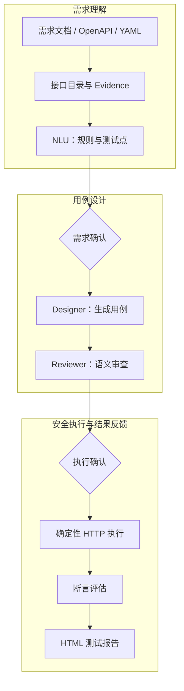

# 基于Multi-Agent的接口自动化测试平台

> 将接口需求文档转换为可追溯的测试点、测试用例和执行报告。
> AI 负责理解和设计，确定性代码负责执行和判定，人工确认负责控制风险。

[产品演示](#产品演示) · [架构设计](#架构设计) · [快速开始](#快速开始) · [测试与验证](#测试与验证)

## 项目简介

这是一个面向接口测试场景的 AI 自动化测试平台。它从 Markdown 需求文档、OpenAPI
或单接口 YAML 契约中提取接口和业务规则，再经过 NLU、Designer、Reviewer 三个工作流角色，
生成带证据引用的测试用例，最后由确定性 HTTP 执行层完成请求、鉴权、断言和报告生成。

它重点解决三个问题：

- 测试人员需要手工把需求文档转换成测试点和测试用例；
- LLM 可能生成缺少依据、不可执行或重复的用例；
- 未经确认的副作用请求可能被误发到真实环境。

## 核心能力

- 需求解析：支持 Markdown、OpenAPI 和“一文件一个接口”的 YAML 契约；
- 证据追溯：接口、业务规则、测试点、用例和报告保留来源关系；
- AI 工作流：NLU 提取需求，Designer 设计用例，Reviewer 进行语义审查；
- 人工闸门：需求确认和执行确认分别控制内容正确性与真实请求授权；
- 确定性执行：HTTP 请求、鉴权注入、断言评估和敏感信息脱敏不交给模型猜测；
- 报告归档：支持批量执行结果、断言明细和 HTML 测试报告。

## 技术栈

| 层次 | 技术 |
| --- | --- |
| 前端 | React 19、TypeScript、Vite |
| 后端 | Python 3.11+、FastAPI、Pydantic、HTTPX |
| AI 工作流 | LangChain、LangGraph、结构化输出 |
| 数据与报告 | 本地 `.data` 目录、JSON 快照、HTML 报告 |
| 质量保障 | Pytest、GitHub Actions、TypeScript/Vite 构建 |

## 产品演示

### 30 秒看懂闭环



### 场景一：从需求文档到可分析接口

<p align="center"></p>

平台把项目、需求文档、接口目录、测试用例和报告放在同一条流程中。用户可以从需求文档开始，
逐个选择接口进入分析，而不是先手工维护一份与需求脱节的测试清单。

### 场景二：AI 分析必须能够回到证据

NLU 根据需求原文和关联证据提取业务规则、成功与失败场景、参数约束和待确认问题。
在进入用例设计前，用户可以检查规则、测试点和证据来源；未确认的需求快照不能继续进入 Designer。

<p align="center"></p>

需求分析完成后，用户可以在确认页逐项检查业务规则、测试点和证据来源：

<p align="center"></p>

### 场景三：执行前有风险闸门，执行后有可解释报告

执行前，平台展示目标环境、用例数量、副作用用例和执行策略，要求人工确认后才会发起真实请求。
执行层按确定性规则完成 HTTP 请求和断言评估，报告中可以查看每条用例的 HTTP 状态、断言结果和失败详情。

执行前确认目标环境和用例范围：

<p align="center"></p>

执行完成后查看 PASS、FAIL、HTTP 状态和断言明细：

<p align="center"></p>

完整的十张流程截图和阶段说明见 [`docs/workflow.md`](docs/workflow.md)。

## 架构设计

### AI、确定性代码与人工确认的边界

| 部分 | 负责内容 | 不负责内容 |
| --- | --- | --- |
| NLU / Designer / Reviewer | 理解业务语义、提取测试点、设计和审查用例 | 不直接发送真实 HTTP 请求 |
| Evidence 层 | 保存需求、OpenAPI、配置和接口事实的来源关系 | 不替代人工确认业务规则 |
| Deterministic Executor | 鉴权注入、请求发送、断言判定、脱敏和报告 | 不让模型猜测 PASS/FAIL |
| Human Gate | 确认需求快照、执行目标和副作用范围 | 不参与每条请求的手工执行 |

这个边界使系统既能利用 LLM 处理自然语言，又能把高风险的执行和判定留在可测试、可审计的代码中。

### 关键设计取舍

- 默认禁止远程目标执行，避免开发环境误把测试请求发往生产服务；
- 凭证只保存为 `env:NAME` 引用，真实值只在请求需要时从进程环境解析；
- Reviewer 输出的是有边界的审查结果和补例规格，最终用例仍经过本地校验；
- 每个工作流快照记录提示词版本和 SHA-256 哈希，便于复现当时的生成条件；
- 当前版本使用本地数据目录，适合作为作品演示和隔离测试环境，不等同于生产级多租户平台。

## 快速开始

### 环境要求

- Python 3.11+
- Node.js 20+
- PowerShell（以下命令以 Windows 为例）

完整 AI 流程需要配置 DeepSeek API Key；不配置时仍可启动前后端、查看界面并运行不依赖外部模型的测试。
示例被测服务和需求契约均为仓库内的本地示例，不需要真实业务账号。

### 1. 启动后端

在终端一执行：

```powershell
cd backend
python -m venv .venv
.\.venv\Scripts\python.exe -m pip install -e ".[dev]"
.\.venv\Scripts\python.exe -m uvicorn app.main:app --reload --port 8000
```

### 2. 启动示例被测服务

在终端二，从仓库根目录执行：

```powershell
.\backend\.venv\Scripts\python.exe -m uvicorn examples.sample_sut.main:app --host 127.0.0.1 --port 18281
```

示例 SUT 地址为 `http://127.0.0.1:18281`，需求契约为
[`examples/requirements/sample-openapi.yaml`](examples/requirements/sample-openapi.yaml)。
创建项目时，将被测服务地址指向该地址，并选择这个本地 OpenAPI 文件。

### 3. 启动前端

在终端三执行：

```powershell
cd frontend
npm ci
npm run dev
```

打开 `http://127.0.0.1:5173`。后端健康检查为 `http://127.0.0.1:8000/health`，
Swagger API 文档为 `http://127.0.0.1:8000/docs`。

### 4. 开启完整 AI 流程（可选）

在启动后端之前，在同一个终端设置环境变量：

```powershell
$env:AI_TEST_LLM_ENABLED = "true"
$env:DEEPSEEK_API_KEY = "只在本机设置，不要提交到仓库"
```

当前版本使用兼容 OpenAI 接口的 DeepSeek 配置，模型和地址由后端统一管理。`.env.example` 只作为变量名参考；
当前后端不会自动加载 `.env` 文件，因此请在启动进程前设置环境变量，或使用部署平台的 Secret 配置。

## 测试与验证

最近一次本地验证结果：

- Backend：`118 passed`
- Backend coverage：`77%`（branch coverage，CI 门槛 `75%`）
- Frontend：`npm run build` 构建成功
- CI：推送和 Pull Request 会分别执行后端测试与前端构建，配置见 [`.github/workflows/ci.yml`](.github/workflows/ci.yml)。

本地验证命令：

```powershell
cd backend
.\.venv\Scripts\python.exe -m pytest

# 查看覆盖率并生成 HTML 报告
.\.venv\Scripts\python.exe -m pytest --cov=app --cov-report=term-missing --cov-report=html

cd ..\frontend
npm run build
```

## 安全边界与当前限制

- 不提交 `.env`、真实账号、密码、Token、API Key 或业务需求原文；
- 默认禁止远程目标和远程 OpenAPI 来源，真实接口执行前请使用隔离环境；
- 报告和项目数据保存在本地 `.data` 目录，后端重启和多实例部署不提供完整生产级持久化；
- 平台不会导入或执行被测项目代码；
- 当前 LLM 配置以 DeepSeek 为默认实现，其他模型服务商尚未做成通用配置界面。

更多安全约束见 [`SECURITY.md`](SECURITY.md)，架构和实现边界见 [`CURRENT_ARCHITECTURE.md`](CURRENT_ARCHITECTURE.md)，
后续演进记录见 [`MIGRATION_PLAN.md`](MIGRATION_PLAN.md)。

## 项目文档

- [`docs/workflow.md`](docs/workflow.md)：完整产品流程、截图索引和部署说明
- [`CURRENT_ARCHITECTURE.md`](CURRENT_ARCHITECTURE.md)：当前架构与实现边界
- [`SECURITY.md`](SECURITY.md)：安全基线
- [`MIGRATION_PLAN.md`](MIGRATION_PLAN.md)：后续演进记录
