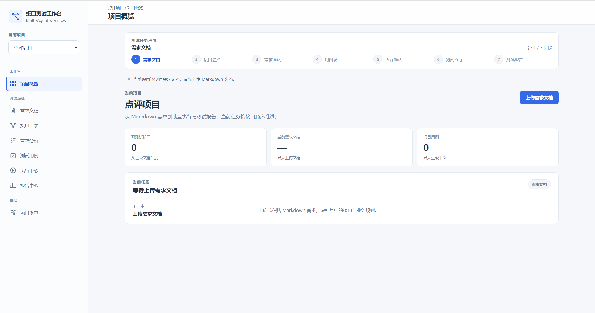
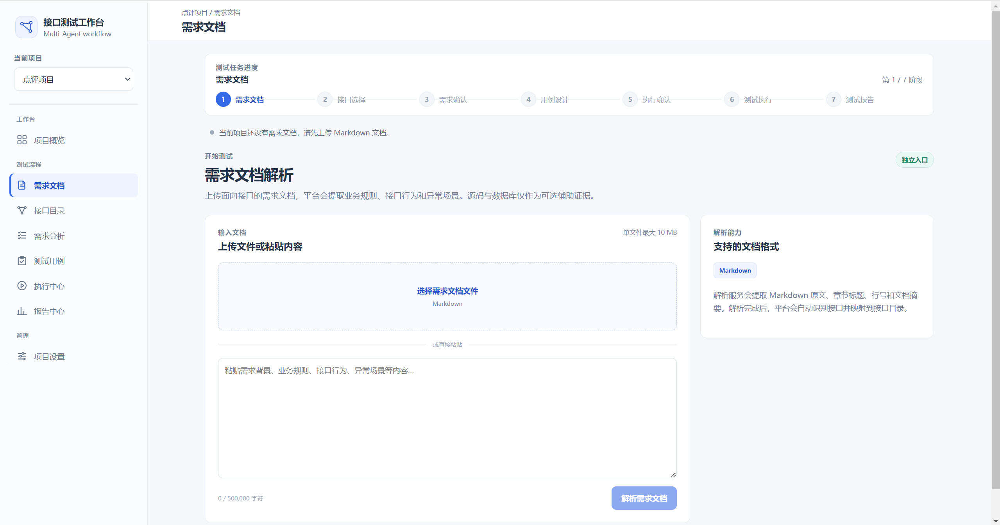
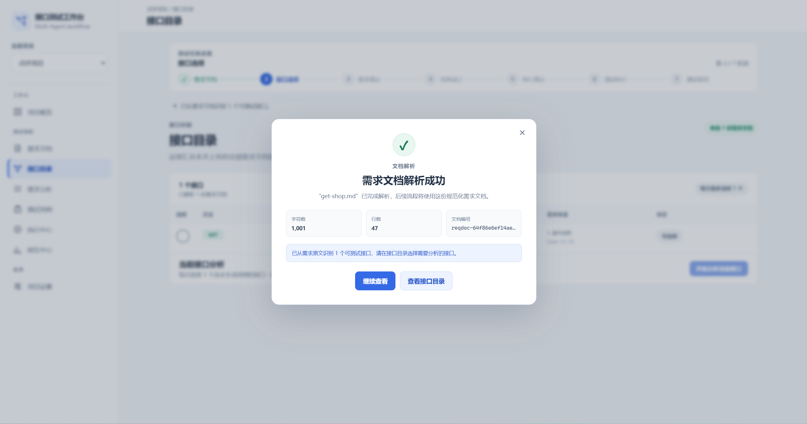
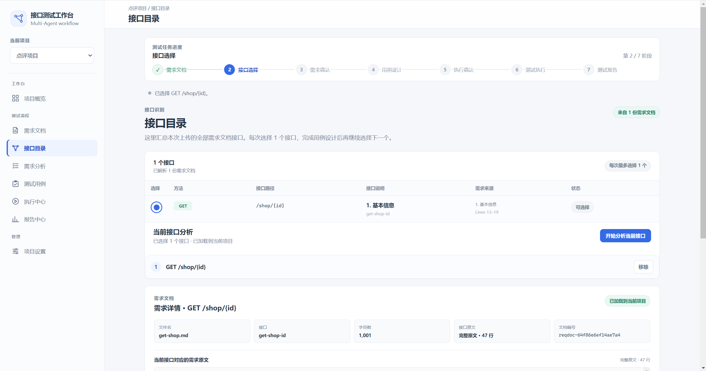
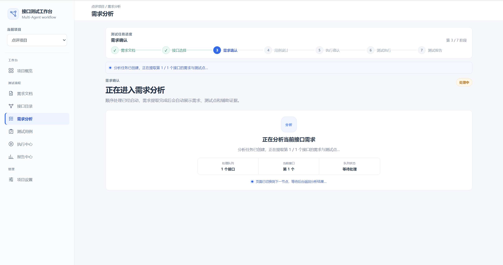
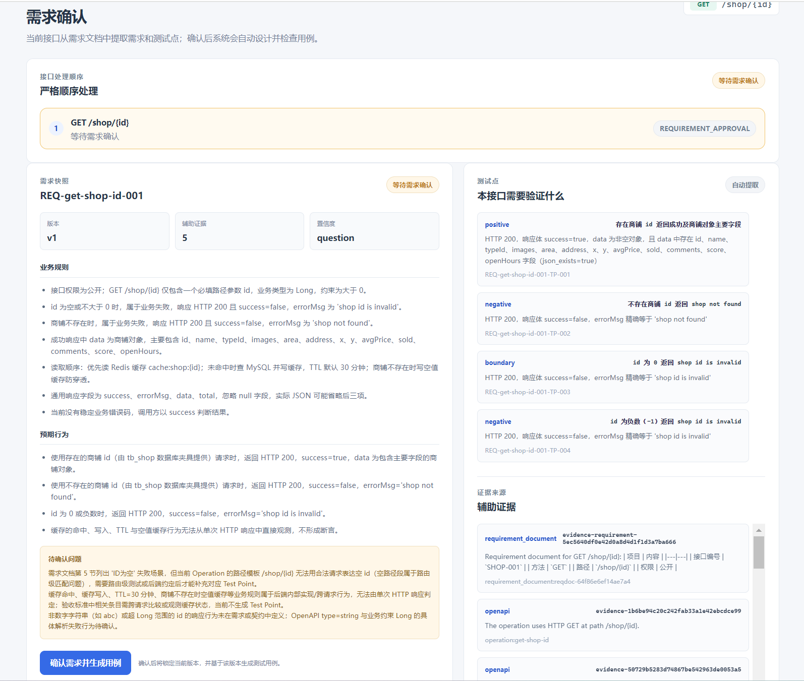
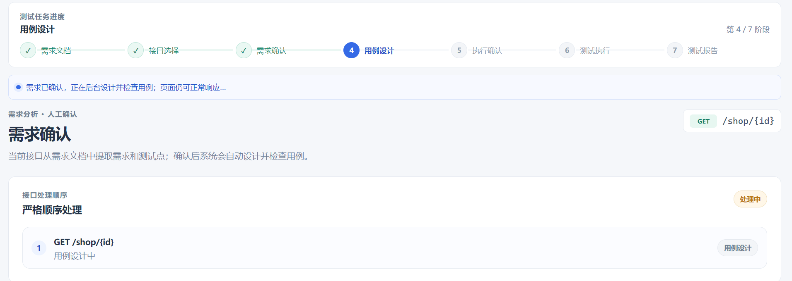
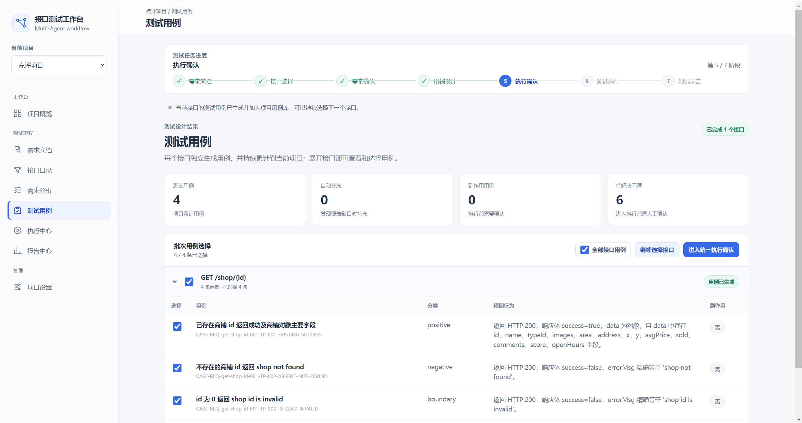
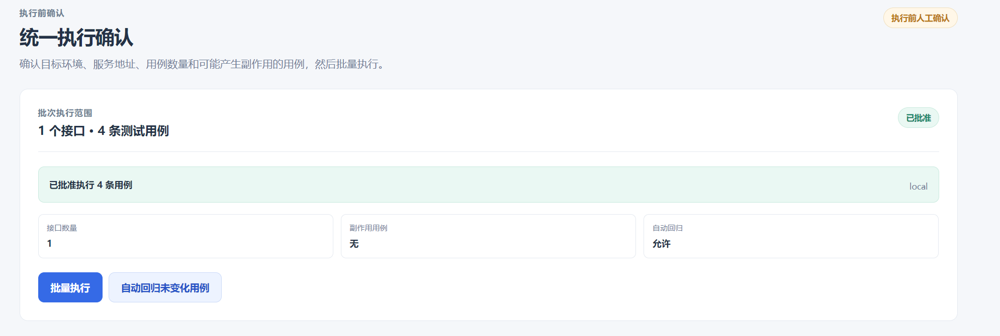
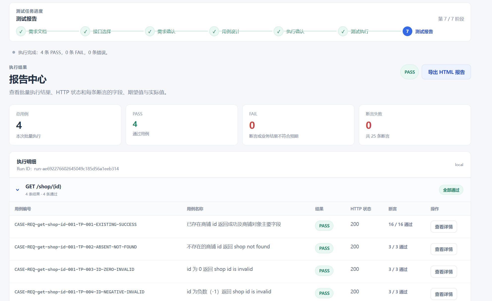

# 产品演示：从需求文档到测试报告

这是本项目的完整前端演示。示例以一个 `GET /shop/{id}` 接口为例，展示平台如何从需求文档
逐步完成接口识别、需求分析、测试用例设计、批量执行和报告生成。

## 一眼看懂流程

```text
需求文档 → 接口选择 → 需求分析 → 需求确认 → 用例设计 → 执行确认 → 测试执行 → 测试报告
```

截图保持原始内容和比例；在本页面中统一使用 960px 展示宽度，避免不同截图的浏览宽度
不一致，也避免强行拉伸页面造成文字变形。

## 1. 项目概览：确认当前任务和阶段

<p align="center"></p>

页面左侧是项目和测试流程导航，顶部是 7 阶段进度条，中间区域显示当前项目、已识别接口、
需求文档和测试用例数量。首次进入时，系统提示先上传需求文档。

## 2. 输入需求文档：上传或粘贴 Markdown

<p align="center"></p>

用户可以上传 Markdown 文件，也可以直接粘贴业务背景、接口规则、异常场景和响应约定。
平台会保留原文，后续解析结果都可以回溯到需求来源。

## 3. 解析成功：识别接口和文档信息

<p align="center"></p>

解析完成后，页面展示文件名、字符数、行数和文档编号，并提示从需求原文中识别出的可测试
接口数量。这里的解析结果会成为后续接口目录和需求分析的输入。

## 4. 接口目录：选择本次要分析的接口

<p align="center"></p>

接口目录将需求文档中的接口集中展示。用户可以查看 HTTP 方法、路径、接口说明、原文行号
和来源文档，并选择一个接口进入后续流程。示例中选择的是 `GET /shop/{id}`。

## 5. 需求分析：提取业务规则和测试点

<p align="center"></p>

NLU 角色根据需求原文和关联证据提取业务规则、成功与失败场景、参数约束和待确认问题。
页面会显示处理队列和当前接口，前端可以在后台处理期间保持响应。

## 6. 需求确认：人工检查分析结果

<p align="center"></p>

用户在这里确认需求快照是否准确：左侧是业务规则和预期行为，右侧是测试点与证据来源，
底部集中显示待确认问题。只有确认后，系统才会进入用例设计，避免未经审核的规则直接驱动
真实测试。

## 7. 用例设计：生成并审查测试用例

<p align="center"></p>

Designer 根据确认后的需求和测试点生成测试用例，Reviewer 负责检查覆盖范围、请求可执行性、
断言和证据映射。该阶段重点是把“应该验证什么”转换成“如何发请求、验证什么结果”。

## 8. 测试用例：选择要执行的用例集合

<p align="center"></p>

用户可以展开接口查看用例名称、分类和预期行为，并批量勾选本次执行范围。示例中覆盖了
成功、资源不存在和参数边界等场景，同时保留待解决问题和副作用用例提示。

## 9. 执行确认：确认目标环境和副作用

<p align="center"></p>

在真正发起请求前，系统要求确认目标环境、服务地址、用例数量、副作用用例以及自动回归
策略。这个人工闸门用于防止误把测试请求发送到生产环境。

## 10. 测试报告：查看执行结果和断言明细

<p align="center"></p>

报告中心汇总本次运行的总用例数、PASS、FAIL 和断言失败数量，并按接口列出每个用例的
HTTP 状态、断言通过数和详情入口。报告还支持导出 HTML，便于归档或交付。

## 演示重点

- 需求、接口、测试点、用例和报告之间保持可追溯关系。
- NLU、Designer、Reviewer 负责理解和审查；HTTP 执行和断言由确定性执行层完成。
- 需求确认和执行确认是两个独立人工闸门，分别控制“规则是否正确”和“是否允许发请求”。
- 示例数据用于展示流程，不代表生产数据；公开仓库前请确认截图中没有真实账号、Token、
  内网地址或业务机密。

## 如何复现

本地启动方式见根目录 [`README.md`](README.md)。流程阶段、部署边界和 GitHub Pages 的
限制见 [`docs/workflow.md`](docs/workflow.md)。
