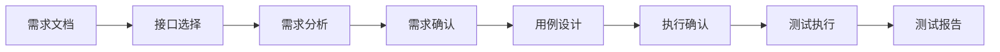

# 产品流程与部署说明

## 1. 完整业务流程



每个阶段都保留可追溯的接口、需求、测试点、测试用例和执行结果。人工确认节点位于
需求确认和执行确认，用于控制模型生成内容和真实接口执行之间的边界。

## 2. 截图索引

| 阶段 | 截图 | 说明 |
| --- | --- | --- |
| 1 | `01-project-overview.png`、`02-requirement-document.png` | 项目概览和需求文档输入 |
| 2 | `03-requirement-parsed.png`、`04-interface-catalog.png` | 文档解析成功和接口选择 |
| 3 | `05-requirement-analysis.png` | 提取接口需求和测试点 |
| 4 | `06-requirement-confirmation.png` | 人工确认业务规则与测试点 |
| 5 | `07-test-case-design.png`、`08-test-cases.png` | 生成并选择测试用例 |
| 6 | `09-execution-confirmation.png` | 确认目标环境和批量执行范围 |
| 7 | `10-test-report.png` | 查看 PASS、FAIL 和断言明细 |

## 3. 本地运行

后端和前端分别启动，默认端口为 `8000` 和 `5173`。前端开发服务器通过 `/api` 代理访问
后端；被测服务建议使用本地或隔离测试环境，默认示例地址为 `127.0.0.1:8081`。

## 4. 在线 Demo 边界

GitHub Pages 适合托管 README、截图和静态介绍页，但不会运行 FastAPI，也不会持久化后端的
本地 `.data` 文件。若要让访问者实际操作，需要将后端部署到可运行 Python 的服务，并让前端
通过同域反向代理或生产 API 地址访问 `/api`。

公开演示建议提供一个不依赖真实密钥的演示项目或 Mock 被测服务，避免把业务账号、数据库
连接串和模型密钥放进仓库或浏览器端。

## 5. 发布前检查

```powershell
git status
git diff --check
cd frontend
npm run build
```

确认没有 `.env`、真实数据、运行产物和未审查的评测结果后，再提交文档和源码变更。
